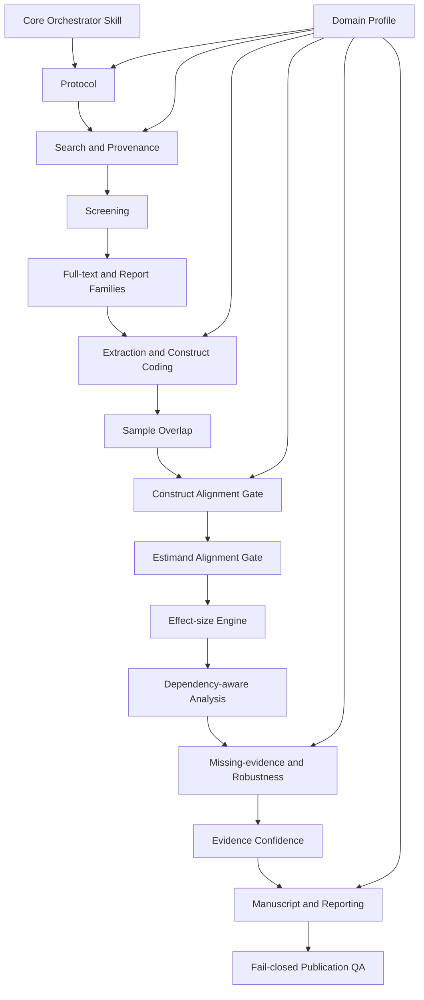

# Econ–Management Meta Skill: Design Specification

**Status:** Approved by the user for implementation planning  
**Working repository name:** `econ-management-meta-skill`  
**Design version:** 1.0  
**Date:** 2026-08-03  
**License target:** Apache License 2.0  
**Normative language:** English is the specification source of truth; Chinese guides are explanatory translations.

## 1. Purpose

`econ-management-meta-skill` is a cross-platform, publication-grade workflow for systematic reviews and meta-analyses in management, economics, innovation, entrepreneurship, marketing, information systems, and related fields.

It is not an automatic paper generator. It is a **fail-closed research workflow** that:

1. structures a review around a theoretical dispute rather than a broad topic;
2. separates construct alignment, estimand alignment, effect-size conversion, dependency handling, and synthesis;
3. keeps AI in an advisory role while reserving consequential research decisions for verified human judgment;
4. creates reproducible, auditable artifacts from protocol through submission package;
5. supports domain-specific extensions through schema-governed declarative profiles;
6. blocks downstream analysis when evidence provenance, verification, or cross-stage consistency is incomplete.

The first official domain profile is `profiles/ai-innovation/`.

## 2. Design Principles

### 2.1 Theory before arithmetic

A study result enters a synthesis only after the system verifies that its theoretical construct, analytical level, design family, contrast, time horizon, and target estimand are compatible with the proposed evidence pool. Mathematical convertibility is not sufficient evidence of substantive comparability.

### 2.2 Human decisions, AI assistance

AI may prioritize records, suggest extraction fields, propose construct mappings, identify candidate effect-size conversions, generate code, and flag inconsistencies. AI may not make final eligibility decisions, finalize construct coding, approve effect sizes, select the primary model, or approve causal claims.

Unverified records retain `AI_SUGGESTED` or `UNVERIFIED` status and are ineligible for primary analysis.

### 2.3 Fail closed

Missing provenance, incompatible estimands, unresolved duplicate samples, unverified effect sizes, stale locks, or manuscript–analysis discrepancies stop the pipeline. Warnings are not permitted to silently become publication artifacts.

### 2.4 Files are the source of truth

CSV, YAML, JSON, BibTeX/RIS, Markdown, Quarto, and R/Python scripts are the canonical project artifacts. SQLite may be used as an optional cache but is not the sole record of research decisions.

### 2.5 Reproducible and FAIR research software

The repository will use versioned releases, rich metadata, explicit licensing, machine-readable schemas, provenance, compatibility declarations, environment locks, and citation metadata. These choices operationalize FAIR4RS principles for findability, accessibility, interoperability, and reusability.

### 2.6 Profiles may strengthen, not weaken, the core

A domain profile can add constructs, search blocks, moderators, boundary cases, risk-of-bias extensions, and stricter quality rules. It cannot disable human verification, protocol locks, dependency checks, estimand alignment, or cross-artifact audits.

## 3. Scope

### 3.1 In scope for version 1.0

- Systematic-review protocol development and versioned registration packages.
- Multi-database search design and import from RIS, BibTeX, CSV, and EndNote XML.
- Optional connectors for open bibliographic services and credential-dependent adapters for subscription databases.
- Deduplication with provenance retention.
- Human screening with optional active-learning prioritization.
- Report-family and study-family reconciliation.
- Dual extraction, construct coding, effect-size verification, and sample-overlap identification.
- Effect sizes: Fisher’s `z`, Hedges’ `g`, log odds ratio, log response ratio, elasticity/semi-elasticity lanes, and model-specific adjusted estimates.
- Multilevel and multivariate meta-analysis, meta-regression, robust variance estimation with small-sample correction, sensitivity analyses, and missing-evidence diagnostics.
- Effect-level risk of bias, methodological descriptors, and synthesis-level evidence confidence.
- Quarto-generated manuscript, supplement, checklists, figures, tables, reproducibility package, and submission manifest.
- Cross-platform agent adapters for Claude Code, Codex, and generic agents.
- English normative specifications plus Chinese user documentation.

### 3.2 Out of scope for version 1.0

- Autonomous final inclusion or exclusion by AI.
- Autonomous causal interpretation.
- Direct automated access to subscription databases without user-supplied legal credentials.
- A universal numeric “study quality score.”
- Automatic merging of cross-sectional associations, adjusted regression estimates, experiments, and quasi-experiments into one pooled effect.
- Network meta-analysis as a core workflow.
- Individual participant data meta-analysis.
- Fully automated extraction from inaccessible or image-only PDFs.
- Multiple-inheritance composition of domain profiles.

## 4. System Architecture

The system uses one orchestrator skill, bounded stage skills, declarative profiles, validation schemas, Python workflow services, an R statistical core, and Quarto reporting.



### 4.1 Repository layout

```text
econ-management-meta-skill/
├── SKILL.md
├── README.md
├── README.zh-CN.md
├── LICENSE
├── NOTICE
├── CITATION.cff
├── CHANGELOG.md
├── CONTRIBUTING.md
├── CODE_OF_CONDUCT.md
├── SECURITY.md
├── pyproject.toml
├── uv.lock
├── renv.lock
├── references/
│   ├── evidence-map.yaml
│   └── methodological-bibliography.bib
├── schemas/
├── skills/
│   ├── econ-management-meta/
│   ├── meta-protocol/
│   ├── meta-search/
│   ├── meta-screening/
│   ├── meta-fulltext/
│   ├── meta-extraction/
│   ├── meta-sample-overlap/
│   ├── meta-construct-alignment/
│   ├── meta-estimand-alignment/
│   ├── meta-effect-size/
│   ├── meta-analysis-r/
│   ├── meta-bias-robustness/
│   ├── meta-evidence-confidence/
│   ├── meta-manuscript/
│   └── meta-publication-qa/
├── profiles/
│   └── ai-innovation/
├── adapters/
│   ├── claude-code/
│   ├── codex/
│   └── generic-agent/
├── templates/
├── scripts/
│   ├── python/
│   └── r/
├── tests/
├── examples/
│   └── golden-project/
├── docs/
│   ├── en/
│   ├── zh-CN/
│   └── design-rationale/
└── .github/
    ├── workflows/
    ├── ISSUE_TEMPLATE/
    └── pull_request_template.md
```

### 4.2 Runtime stack

- **Python + `uv`:** project initialization, imports, deduplication, reconciliation, schema validation, state transitions, provenance, lock generation, audit reports, and adapter logic.
- **R + `renv`:** effect-size computation, random-effects models, multilevel/multivariate models, robust variance estimation, meta-regression, diagnostics, publication-selection sensitivity models, and figures.
- **Quarto:** manuscript, supplement, HTML audit report, PDF, and Word output from the same result objects.
- **Cross-language interfaces:** CSV, YAML, JSON, Arrow/Parquet only when justified by scale, and standardized result manifests.

Formal statistical estimates must originate from versioned R scripts and serialized result objects, not from language-model arithmetic.

## 5. End-to-End Workflow

### Stage 00 — Project intake and feasibility scan

Outputs:

- `project.yaml`
- `00_intake/research-question.md`
- `00_intake/feasibility-scan.md`
- `00_intake/theoretical-dispute.md`
- preliminary construct map and evidence lanes

The scan may inspect seed studies and test search terms but cannot create final eligibility decisions or formal effect-size records.

### Stage 01 — Protocol Lock

The first formal freeze occurs before production screening and effect extraction.

The protocol fixes:

- theoretical question and unit of inference;
- construct boundaries and nearby exclusions;
- eligibility criteria;
- evidence lanes;
- databases, grey literature, citation chasing, and update-search plan;
- screening and extraction roles;
- risk-of-bias framework;
- primary, secondary, sensitivity, and exploratory analyses;
- AI assistance declaration.

Artifacts:

```text
01_protocol/
├── protocol-v1.0.yaml
├── protocol-v1.0.md
├── osf-registration-package/
├── search-plan.yaml
├── eligibility.yaml
├── evidence-lanes.yaml
└── amendments/
locks/protocol-v1.0.lock.yaml
```

Protocol files are append-versioned, never overwritten.

### Stage 02 — Search and evidence-source provenance

The default architecture is hybrid:

- generate platform-specific search strings;
- allow human execution in subscription databases;
- import RIS, BibTeX, CSV, and EndNote XML;
- optionally call open APIs;
- retain database, platform, date, query, result count, export batch, and file hash;
- conduct backward, forward, author, working-paper, dissertation, and conference searches;
- map publication versions into report families.

Artifacts:

```text
02_search/
├── strategies/
├── raw-exports/
├── imported-records.csv
├── evidence-source-registry.csv
├── report-family-map.csv
├── author-contact-log.csv
└── search-audit.md
```

### Stage 03 — Screening

Default mode:

- active learning may prioritize presentation order;
- two human reviewers independently screen titles and abstracts;
- AI never has final exclusion authority;
- full-text eligibility is decided by two independent human reviewers;
- exclusion reasons and supporting pages are required at full text;
- `record_id`, `report_id`, `study_id`, and `report_family_id` remain distinct.

Optional audited accelerated mode requires preregistration, a random audit of the unseen pool, target-recall documentation, and two-person approval. Early stopping is disabled by default.

Cohen’s kappa is reported with raw agreement, inclusion agreement, exclusion agreement, conflict count, and conflict categories. Kappa is a diagnostic, not a sole pass threshold.

### Stage 04 — Full-text and study-family management

This stage reconciles multiple reports of the same underlying study and identifies:

- working paper → conference → accepted manuscript → journal article chains;
- dissertation chapters later published as articles;
- overlapping corporate, patent, panel, or survey samples;
- inaccessible reports and author-contact attempts.

Artifacts include immutable manifests and human-verified family assignments.

### Stage 05 — Dual extraction and evidence traceability

Every primary extraction record stores:

- source page or section;
- short source quotation where legally appropriate;
- extractor 1 and extractor 2 values;
- resolution status;
- original and resolved values;
- human verifier and timestamp;
- provenance to article, study, sample, dataset family, and effect.

AI suggestions are segregated from verified values.

### Stage 06 — Construct-first alignment

Each construct instance records:

- reported label;
- author definition;
- operational measure;
- analytical level;
- theoretical role;
- canonical construct;
- mapping relationship;
- proxy distance;
- supporting pages and coding rationale.

Allowed mapping relationships:

```text
EXACT_EQUIVALENT
NEAR_EQUIVALENT
SUBDIMENSION_OF
BROADER_THAN
NARROWER_THAN
RELATED_BUT_DISTINCT
OBJECTIVE_PROXY_FOR
AMBIGUOUS
NON_EQUIVALENT
```

The gate blocks unverified or substantively incompatible mappings.

Measurement-error handling creates parallel lanes:

- observed effects;
- artifact-corrected effects when a defensible measurement model and reliability evidence exist.

No universal reliability value is imputed silently.

### Stage 07 — Estimand-first alignment

Results are assigned to evidence lanes before conversion:

1. marginal/zero-order association;
2. adjusted association;
3. randomized experimental contrast;
4. quasi-experimental or causal estimate;
5. elasticity, semi-elasticity, ratio, or proportional change;
6. narrative but non-poolable evidence.

The gate checks treatment, comparator, outcome, unit, time horizon, adjustment set, functional form, and inferential target.

Blocked combinations include:

- zero-order and adjusted estimates;
- associational and causal estimands;
- individual-, team-, firm-, and patent-level effects without explicit multilevel theory;
- incompatible treatment or control definitions;
- native and approximate reconstructed effects without separate labels.

### Stage 08 — Effect-size conversion and lock

Supported targets:

- Fisher’s `z` for correlations;
- Hedges’ `g` for continuous experimental contrasts;
- log odds ratio for binary contrasts;
- log response ratio for multiplicative outcomes;
- native-scale or harmonized elasticity/semi-elasticity estimates;
- model-specific adjusted estimates when sufficiently comparable.

Every conversion must be reproducible from verified source statistics. Approximate beta-to-correlation reconstructions are segregated as `RECONSTRUCTED_APPROXIMATION` and excluded from the default primary zero-order lane.

After verification, the effect pool is frozen:

```text
locks/effect-size-pool-v1.0.lock.yaml
```

### Stage 09 — Analysis Specification Lock

After extraction, alignment, effect-size verification, and dependency-structure discovery—but before pooled estimates are inspected—the project freezes:

- final effect pools;
- dependency model;
- covariance strategy;
- heterogeneity estimator;
- interval method;
- confirmatory moderators;
- missing-evidence diagnostics;
- sensitivity analyses.

Changes are classified as clarification, prospective minor amendment, prospective major amendment, post-outcome amendment, or protocol deviation.

Every model output records protocol version, analysis-spec version, study-pool hash, effect-pool hash, code commit, and environment lock.

### Stage 10 — Adaptive dependency engine and primary synthesis

Mandatory identifiers:

```text
article_id
study_id
sample_id
dataset_family_id
effect_id
outcome_family
timepoint
contrast_id
```

Routing logic:

1. known or derivable sampling covariance → multivariate/multilevel model;
2. unknown covariance → multilevel model plus CR2 cluster-robust inference;
3. assumed within-study correlation → predeclared sensitivity grid;
4. sparse moderators or low effective degrees of freedom → block inferential moderator claims;
5. cross-article dataset overlap → deduplication, higher-level clustering, or replacement sensitivity analysis according to the protocol.

Primary R implementation targets:

```r
metafor::rma.mv(...)
clubSandwich::coef_test(..., vcov = "CR2")
```

### Stage 11 — Theory-first heterogeneity

The workflow distinguishes:

- conceptual heterogeneity;
- estimand heterogeneity;
- contextual/theoretical heterogeneity;
- methodological heterogeneity.

Conceptual and estimand heterogeneity are resolved upstream; they are not excused by a random-effects model.

Each meta-analysis reports, when interpretable:

- pooled estimate and confidence interval;
- `tau²`, `tau`, and `I²` with uncertainty where feasible;
- prediction interval;
- cluster count and effective degrees of freedom;
- influence diagnostics.

Confirmatory moderators require a preregistered card containing mechanism, expected direction, target pool, level, coding rule, alternative explanations, and information thresholds. Post-outcome moderators are labeled exploratory.

Method moderators cannot be presented as substantive mechanisms without further argument.

### Stage 12 — Missing-evidence triangulation

The engine separates:

- missing studies;
- missing reports;
- missing outcomes within identified studies;
- small-study effects;
- model sensitivity under alternative selection mechanisms.

The default sequence is:

1. inspect search coverage and report-family completeness;
2. identify expected but unreported outcomes;
3. determine whether asymmetry diagnostics are interpretable;
4. route tests by effect-size type and dependency structure;
5. run multiple sensitivity approaches when justified;
6. produce a human-verified synthesis-level judgment.

`trim-and-fill` is exploratory only. Fail-safe `N` is not accepted as evidence that publication bias is absent.

### Stage 13 — Three-layer evidence credibility

#### Layer 1: effect-level risk of bias

Domains adapt to study design and include:

- selection or assignment;
- confounding and endogeneity;
- temporal ordering and reverse causality;
- exposure/intervention classification;
- missing data and attrition;
- outcome measurement;
- selective analysis and reporting.

Each judgment records direction of bias, rationale, supporting pages, reviewer decisions, and human verification.

#### Layer 2: methodological and reporting descriptors

- construct validity;
- reliability;
- representativeness and external validity;
- precision;
- extractability;
- transparency and open materials;
- preregistration;
- data/code availability.

#### Layer 3: synthesis-level confidence

- study-level risk of bias;
- inconsistency;
- indirectness;
- imprecision;
- missing evidence;
- sample dependence and overlap;
- estimand alignment.

The workflow does not compute a universal additive quality score and does not use arbitrary quality weights.

### Stage 14 — Journal-ready reporting

Quarto is the normative manuscript source. The output engine creates, as appropriate:

```text
manuscript.docx
manuscript-anonymous.docx
manuscript.pdf
manuscript.html
supplement.pdf
prisma-checklist.docx
prisma-s-checklist.docx
moose-checklist.docx
protocol-deviation-table.csv
fulltext-exclusion-list.csv
data-and-code-availability.md
reproduction-guide.md
submission-manifest.json
```

Reporting profiles route PRISMA 2020, PRISMA-S, and MOOSE requirements by review type. Completion of a reporting checklist is not treated as a study-quality score.

Every manuscript claim is linked to a result, model, effect pool, and source evidence. Claim audit blocks associational findings written as causal and blocks certainty language exceeding the synthesis-confidence judgment.

### Stage 15 — Fail-closed publication QA

The QA engine performs:

- schema validation;
- verification-status checks;
- ID reconciliation;
- effect recomputation;
- dependency checks;
- lock verification;
- model-to-table and model-to-figure comparisons;
- PRISMA count reconciliation;
- claim audit;
- protocol-deviation reporting;
- clean-room rebuilding.

P0 blocking errors prevent release. P1 errors must be resolved before submission. P2 findings must be disclosed.

## 6. Project State and Audit Model

Canonical project files:

```text
project.yaml
state/pipeline-state.yaml
state/decision-log.csv
state/artifact-manifest.json
locks/protocol-v*.lock.yaml
locks/study-pool-v*.lock.yaml
locks/effect-size-pool-v*.lock.yaml
locks/analysis-spec-v*.lock.yaml
```

### 6.1 Pipeline state

Each stage records:

```yaml
stage_id: effect-size
status: VERIFIED
started_at: 2026-08-03T10:00:00Z
completed_at: 2026-08-05T16:30:00Z
verified_by:
  - reviewer_1
  - reviewer_2
inputs:
  extraction_manifest: sha256:...
outputs:
  effect_pool: sha256:...
protocol_version: 1.1
analysis_spec_version: null
```

Allowed statuses:

```text
NOT_STARTED
IN_PROGRESS
BLOCKED
READY_FOR_REVIEW
VERIFIED
LOCKED
SUPERSEDED
```

`AI_SUGGESTED` and `UNVERIFIED` are artifact-verification states, not completed pipeline states.

### 6.2 Decision log

Every consequential decision stores:

- stable ID;
- timestamp;
- actor;
- stage;
- decision type;
- original value;
- revised value;
- rationale;
- evidence location;
- result information already observed;
- human-verification status;
- affected artifacts.

### 6.3 Lock behavior

- Locked files are never silently overwritten.
- Any change creates a new version and a new hash.
- Downstream artifacts become stale when an upstream lock changes.
- Regeneration begins at the first affected stage.
- Every result and manuscript output records the precise lock versions used.

## 7. Profile Contract

### 7.1 Profile manifest

```yaml
profile:
  id: ai-innovation
  name: AI and Innovation
  version: 0.1.0
  schema_version: 1
  core_compatibility: ">=0.1.0,<1.0.0"
  language: en
  status: experimental
extends: core-management-meta
```

### 7.2 Permitted extensions

A profile may:

- add domain constructs and synonyms;
- define adjacent but excluded constructs;
- add search concept blocks and translations;
- add eligibility boundary cases;
- add theoretical and methodological moderators;
- add design-specific risk-of-bias prompts;
- add terminology and reporting templates;
- require stricter thresholds.

### 7.3 Forbidden overrides

A profile may not:

- allow AI final screening decisions;
- reduce full-text review below two independent humans;
- admit unverified effect sizes;
- bypass construct or estimand gates;
- disable dependency or overlap checks;
- disable protocol or analysis locks;
- relabel post-outcome exploration as confirmatory;
- disable manuscript–result consistency checks.

### 7.4 Profile loading

Profiles contain no executable code in version 1.0. Loading order:

1. validate profile schema;
2. validate core compatibility;
3. validate unique IDs and references;
4. test that overrides only strengthen requirements;
5. run profile positive and negative fixtures;
6. copy the validated profile into the project manifest.

## 8. AI-and-Innovation Profile

### 8.1 AI construct tree

```text
AI exposure
├── AI adoption
├── AI use intensity
├── AI investment
├── AI human capital
├── AI organizational capability
├── AI technological input
├── AI-assisted decision making
├── AI automation
├── AI augmentation
└── generative-AI intervention
```

### 8.2 Innovation outcome tree

```text
Innovation outcomes
├── creativity and ideation
│   ├── originality
│   ├── usefulness
│   └── diversity
├── innovation process
│   ├── speed
│   ├── search breadth
│   └── development efficiency
├── innovation output
│   ├── patent quantity
│   ├── new-product quantity
│   └── innovation probability
├── innovation quality
│   ├── citations
│   ├── economic value
│   └── technical impact
└── innovation novelty
    ├── radicalness
    ├── recombinatory novelty
    └── technological distance
```

### 8.3 Initial moderators

#### Theoretical moderators

- automation versus augmentation;
- innovation stage;
- task complexity;
- participant or worker expertise;
- knowledge distance;
- organizational complementarity;
- environmental uncertainty;
- human–AI interaction structure.

#### Method moderators

- self-report versus objective outcomes;
- cross-sectional versus longitudinal;
- same-source versus multisource;
- published versus unpublished;
- direct measure versus indirect proxy;
- experimental-control condition;
- weak versus strong causal identification.

## 9. Study-Design Modules

### 9.1 Randomized experiments

Assess:

- randomization and allocation;
- baseline equivalence;
- attrition;
- intervention fidelity;
- blinding where meaningful;
- outcome measurement;
- selective reporting;
- treatment/control contrast definition.

### 9.2 Survey and cross-sectional studies

Assess:

- sampling frame;
- common-method risk;
- construct validity;
- adjustment-set consistency;
- temporal ambiguity;
- nonresponse;
- selective model reporting.

### 9.3 Archival panel studies

Assess:

- sample construction;
- variable measurement;
- unit and time alignment;
- missing panel observations;
- fixed-effects structure;
- serial dependence;
- reverse causality;
- specification selection.

### 9.4 Quasi-experimental designs

The profile routes to design-specific prompts for:

- difference-in-differences;
- regression discontinuity;
- instrumental variables;
- synthetic control;
- matching and weighting;
- event studies.

Each module evaluates its identifying assumptions rather than using a generic observational checklist.

### 9.5 Patent, bibliometric, text, and ML measurement

Assess:

- database coverage;
- unit of analysis;
- name/entity disambiguation;
- classification and search-query validity;
- truncation and citation-window effects;
- text-dictionary or classifier validation;
- train/test leakage;
- domain shift;
- model-version and threshold documentation.

## 10. Quality Assurance

### 10.1 Error severity

```text
P0_BLOCKING
P1_MUST_RESOLVE
P2_DISCLOSURE_REQUIRED
P3_INFORMATIONAL
```

### 10.2 P0 examples

- study-pool lock disagrees with screening consensus;
- unverified effect enters a primary model;
- effect cannot be recalculated from source statistics;
- unresolved duplicate samples are treated as independent;
- model uses stale data or stale locks;
- manuscript value differs from R result object;
- protocol or analysis-spec version is absent;
- profile attempts a forbidden override.

### 10.3 P1 examples

- confirmatory moderator lacks effective degrees of freedom;
- full-text exclusion reason is missing;
- construct mapping lacks dual verification;
- missing-evidence diagnostic is inappropriate for the effect metric;
- required reporting item is unresolved before submission.

### 10.4 Golden project

`examples/golden-project/` will contain a small synthetic review with:

- duplicate reports;
- overlapping datasets;
- construct mismatches;
- multiple dependent effects;
- exact and approximate conversions;
- known correct outputs;
- intentionally corrupted variants.

CI must detect every corrupted variant and reproduce the approved reference outputs.

### 10.5 Test layers

#### Software tests

- Python unit and integration tests;
- schema tests;
- R function tests;
- adapter contract tests;
- Quarto rendering tests;
- package and environment checks.

#### Research-logic tests

- ID-set reconciliation;
- verification status;
- effect recomputation;
- alignment gate status;
- dependency declarations;
- lock integrity;
- model-input eligibility.

#### Cross-artifact tests

- PRISMA counts versus screening files;
- study count versus model clusters;
- forest-plot rows versus effect pool;
- table cells versus R results;
- abstract claims versus main results;
- exclusion supplement versus full-text consensus.

## 11. Failure Recovery

Every passed stage creates a checkpoint containing:

- checkpoint ID;
- Git commit SHA;
- protocol and analysis-spec versions;
- study and effect-pool hashes;
- Python and R environment hashes;
- artifact manifest.

Recovery returns to the last valid checkpoint and regenerates downstream artifacts. Direct patching of result tables, figures, or manuscript numbers is prohibited.

## 12. Platform Adapters

The core is platform independent. Adapters translate the same contracts into platform-specific instructions.

### 12.1 Claude Code

- Skill-discovery layout and slash-command-compatible entry points.
- File and shell operations mapped to Claude Code conventions.

### 12.2 Codex

- Agent instructions, plan/test workflow, repository operations, and explicit verification checkpoints tailored to Codex.

### 12.3 Generic agent

- Plain `SKILL.md` contract using abstract capabilities: read, write, execute Python, execute R, render Quarto, request human approval.

Adapters may not change methodology or state transitions.

## 13. Security and Privacy

- No credentials committed to the repository.
- Database tokens loaded from environment variables or user-local secret stores.
- Full-text PDFs and licensed exports excluded from public examples unless redistribution is permitted.
- Logs redact credentials and sensitive paths.
- Profile packages contain no executable code in version 1.0.
- Connector use must respect database terms and institutional licenses.

## 14. Licensing, Attribution, and External Sources

The new repository will use Apache License 2.0.

It may learn general workflow principles from existing projects, but it will not copy incompatible non-commercial/share-alike implementations. Any reused Apache-2.0, MIT, BSD, or similarly compatible code will be tracked in `NOTICE`, with file-level provenance where required.

The design particularly draws on:

- organizational meta-analysis methods;
- PRISMA 2020, PRISMA-P, and PRISMA-S;
- active-learning screening research and ASReview;
- `metafor` and `clubSandwich` statistical capabilities;
- Quarto reproducible publishing;
- OSF registration practices;
- FAIR4RS software principles.

## 15. Evidence Base and Design Rationale

The implementation will maintain a machine-readable `references/evidence-map.yaml` linking each major design rule to its supporting source and the local files it governs.

Initial sources:

1. Morris, S. B. (2023). “Meta-Analysis in Organizational Research: A Guide to Methodological Options.” *Annual Review of Organizational Psychology and Organizational Behavior*, 10, 225–259. https://doi.org/10.1146/annurev-orgpsych-031921-021922
2. Page, M. J., et al. (2021). “The PRISMA 2020 statement: an updated guideline for reporting systematic reviews.” *BMJ*, 372, n71. https://doi.org/10.1136/bmj.n71
3. Rethlefsen, M. L., et al. (2021). “PRISMA-S: an extension to the PRISMA Statement for Reporting Literature Searches in Systematic Reviews.” *Systematic Reviews*, 10, 39. https://doi.org/10.1186/s13643-020-01542-z
4. van de Schoot, R., et al. (2021). “An open source machine learning framework for efficient and transparent systematic reviews.” *Nature Machine Intelligence*, 3, 125–133. https://doi.org/10.1038/s42256-020-00287-7
5. Barker, M., et al. (2022). “Introducing the FAIR Principles for research software.” *Scientific Data*, 9, 622. https://doi.org/10.1038/s41597-022-01710-x
6. Viechtbauer, W. `metafor` documentation and multilevel/multivariate analysis guidance. https://www.metafor-project.org/
7. Pustejovsky, J. E. `clubSandwich` documentation, including CR2 robust variance estimation for dependent effects. https://jepusto.github.io/clubSandwich/
8. Quarto documentation for computational documents and HTML/PDF/Word publishing. https://quarto.org/docs/guide/
9. OSF support documentation for registrations and generalized systematic-review registrations. https://help.osf.io/article/330-welcome-to-registrations
10. Apache Software Foundation. Apache License 2.0 and application guidance. https://www.apache.org/licenses/LICENSE-2.0.html

Additional design-rationale notes will cover:

- risk of bias versus study quality;
- dependent effect sizes;
- construct harmonization;
- estimand alignment;
- publication-selection sensitivity;
- moderator-information thresholds;
- sample overlap and report families;
- research-software reproducibility.

## 16. Release and Versioning

Semantic versioning:

```text
0.1.0  Reviewable architecture and schema prototype
0.2.0  Executable core pipeline
0.3.0  AI-and-innovation profile
0.9.0  Release candidate with clean-room reproduction
1.0.0  Stable publication-grade release
```

Every release includes:

- Git tag and GitHub Release;
- changelog;
- `CITATION.cff`;
- compatibility matrix;
- environment locks;
- golden-project QA report;
- source and license notices;
- release manifest;
- optional Zenodo archive and DOI.

## 17. Implementation Sequence

Implementation will be planned after the user approves this written specification.

Recommended phases:

1. schemas, project state, locks, and profile contract;
2. protocol, amendment, and search-provenance modules;
3. screening, report-family, and extraction modules;
4. construct and estimand gates;
5. effect-size and dependency-aware R engine;
6. bias, heterogeneity, missing-evidence, and evidence-confidence modules;
7. Quarto reporting and claim traceability;
8. fail-closed QA and golden project;
9. cross-platform adapters;
10. AI-and-innovation profile;
11. clean-room release process.

## 18. Acceptance Criteria

The design is implemented successfully when:

1. a new project can be initialized from one topic and one profile;
2. no primary effect can enter analysis without source provenance and human verification;
3. construct and estimand incompatibilities are blocked with explicit error codes;
4. overlapping studies, reports, samples, and datasets are represented separately;
5. dependent effects are routed to a justified covariance/multilevel/RVE strategy;
6. protocol and analysis-spec amendments are versioned and reported;
7. manuscript numbers are generated from R result objects and survive cross-artifact checks;
8. the golden project reproduces approved outputs and detects planted errors;
9. Claude Code, Codex, and generic adapters pass the same contract tests;
10. `profiles/ai-innovation/` passes schema validation and cannot weaken core gates;
11. a clean clone can rebuild the complete demonstration manuscript and audit package;
12. the release includes clear English specifications and a usable Chinese guide.

## 19. Explicit Non-Claims

The tool will not claim that:

- AI screening guarantees complete recall;
- a significant pooled effect establishes causality;
- a random-effects model resolves construct or estimand mismatch;
- a funnel-plot asymmetry test proves publication bias;
- a corrected effect is the uniquely true effect;
- compliance with PRISMA proves methodological quality;
- one numeric score can summarize study credibility;
- a domain profile constitutes a validated scientific ontology without expert review.

## 20. Review Gate

The user approved this written specification on 2026-08-03. The next artifact is a detailed implementation plan with tasks, tests, dependencies, review checkpoints, and release milestones.

Implementation plan: [`../plans/2026-08-03-callable-core-v0.1.0.md`](../plans/2026-08-03-callable-core-v0.1.0.md).
